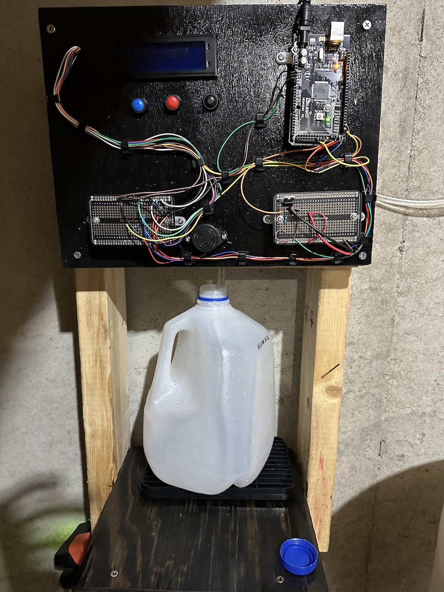
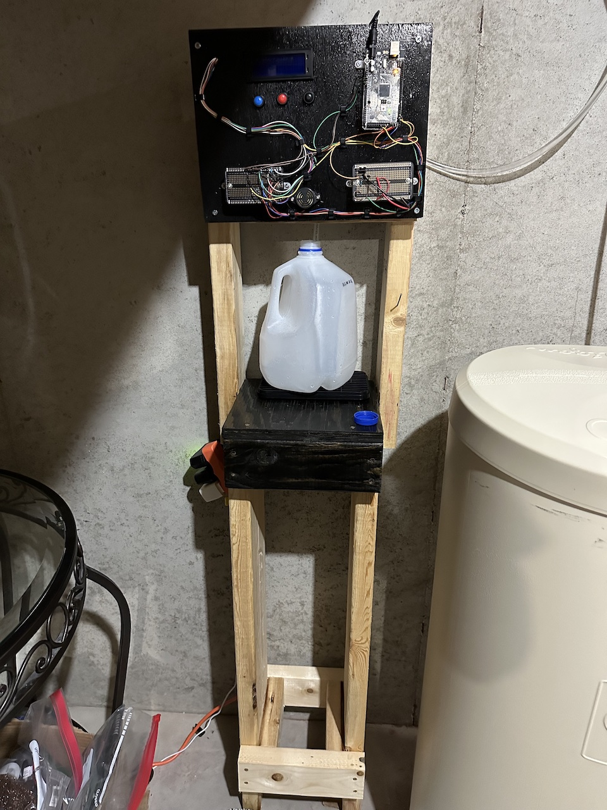
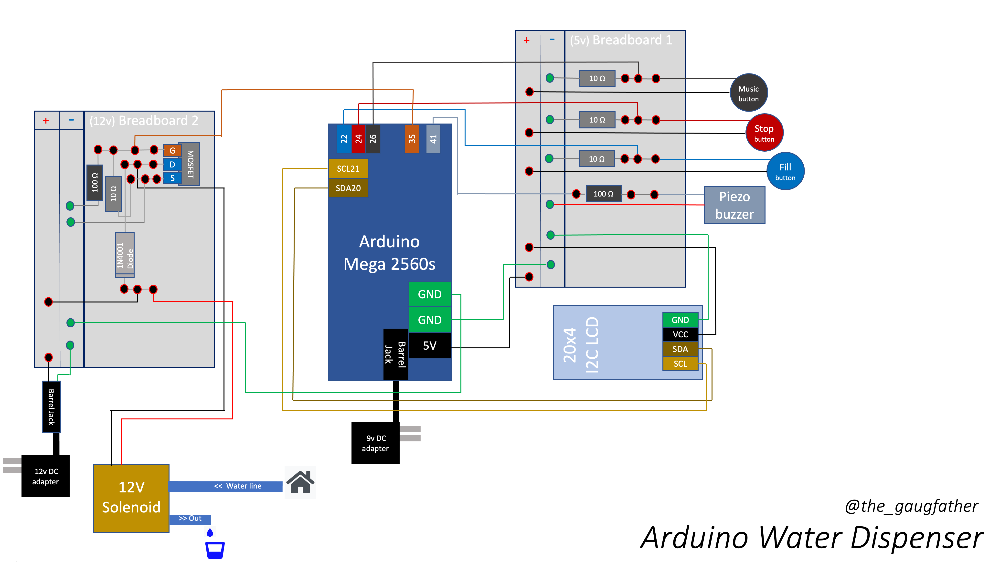

# Arduino Water Dispenser
A fully functioning water dispenser!
* Fills up gallon and quart jugs
* And.. plays music

Medium: https://gaugfather.medium.com/arduino-water-dispenser-c5322f93ebb2

---
## 😒 Background Annoyance
> I live in rural Wisconsin and my home uses a Well Water. We use a water treatment system with a softener and reverse osmosis for drinking water. This system works great but my reverse osmosis drinking water is only available through my refrigerator. The refrigerator water dispenser is fine but many times it takes toooo long to sit and hold my cup next to it to fill. We also have an active family that reuses large water containers, some of which can’t easily fit in the refrigerator. The previous workaround is to either avoid the reverse osmosis or stand and wait, and wait, and wait, and wait, for our large containers to fill. Ain’t nobody got time for that.

## Inspiration 🧐
> Can I easily refill large, custom, water containers without standing and waiting, so that I’m not bored and yet also utilize my drinking water system?  I did some googling and found [this video](https://www.youtube.com/watch?v=S3okv0jYZUc). A fun awesome watch!! That was all the inspiration and validation I needed to know we can fix this. I had been wanting to explore arduino and builds anyway!

# Demo 🙌
Works beautifully 💦

- [Video - water fill (blue button)](https://youtu.be/UvdjGe6BHBg)
    - Turn on lcd backlight, start filling dispenser
- [Video - start and stop (blue/red buttons)](https://youtube.com/shorts/QCrv-ypW9bc)
    - Stop dispenser
- [Video - music player (black button)](https://youtu.be/io0qEygT9qc)
    - Play music, or if currently dispensing, change container size to quart

## Design
    

## Parts
- Arduino Mega 2560
- [12v solenoid ¼ normally closed](https://www.amazon.com/gp/product/B084YTNG2P/ref=ppx_yo_dt_b_search_asin_title?ie=UTF8&psc=1)
- [N-channel Mosfet](https://www.adafruit.com/product/355)
- [20x4 I2C LCD display](https://www.amazon.com/gp/product/B01GPUMP9C/ref=ppx_yo_dt_b_asin_title_o00_s00?ie=UTF8&psc=1)
- [3 push buttons](https://www.amazon.com/gp/product/B07F8GBWGG/ref=ppx_yo_dt_b_search_asin_title?ie=UTF8&psc=1)
- [Piezo buzzer](https://www.amazon.com/gp/product/B075PT19J2/ref=ppx_yo_dt_b_search_asin_title?ie=UTF8&psc=1)
- [1N4001 Diode](https://www.adafruit.com/product/755)
- [9v DC adapter](https://www.amazon.com/gp/product/B018OLREG4/ref=ppx_od_dt_b_asin_title_s00?ie=UTF8&psc=1)
- [DC barrel jack adapter](https://www.adafruit.com/product/368)
- [2 x 3/8 in. O.D. x 1/4 in. MIP](https://www.homedepot.com/p/John-Guest-3-8-in-O-D-x-1-4-in-MIP-NPTF-Polypropylene-Push-to-Connect-Adapter-Fitting-803269/300753461)
- 4 x 10 Ω resistors
- 2 x 100 Ω resistors
- [12v DC adapter](https://www.adafruit.com/product/798)

## Mega Thanks!
- [Project inspiration](https://www.youtube.com/watch?v=S3okv0jYZUc)
- [Music](https://github.com/robsoncouto/arduino-songs)
- [LED character codes](https://lastminuteengineers.com/arduino-1602-character-lcd-tutorial/)
- Arduino builds
    - [Soldering](https://www.youtube.com/watch?v=l9Kbr8cPqOE&list=LL&index=3)
    - [MOSFETs](https://www.youtube.com/watch?v=3PkpOeHTnfo&list=LL&index=4)