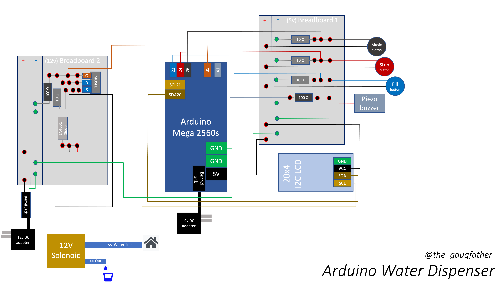

# arduino-water-dispenser
My first arduino build.  A fully functioning water dispenser!
* Fills up gallon and quart jugs
* And.. plays music

## Mega Thanks!
* ### Project inspiration: https://www.youtube.com/watch?v=S3okv0jYZUc
* Design:
 
* Music: https://github.com/robsoncouto/arduino-songs
* Character codes: https://lastminuteengineers.com/arduino-1602-character-lcd-tutorial/
* Arduino builds:
    * Soldering: https://www.youtube.com/watch?v=l9Kbr8cPqOE&list=LL&index=3 
    * MOSFETs: https://www.youtube.com/watch?v=3PkpOeHTnfo&list=LL&index=4